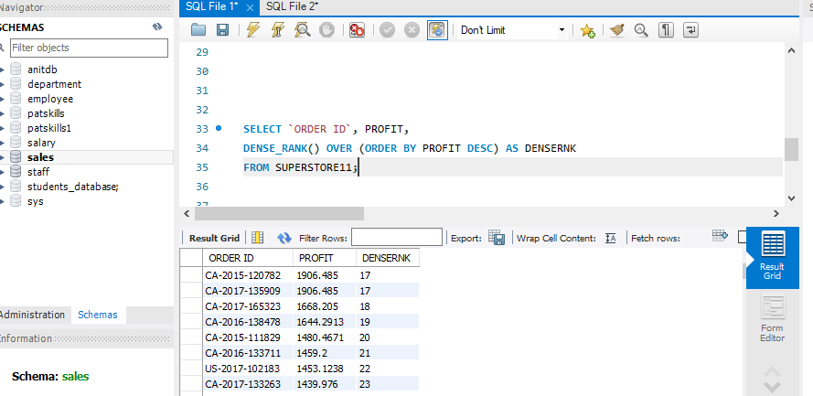
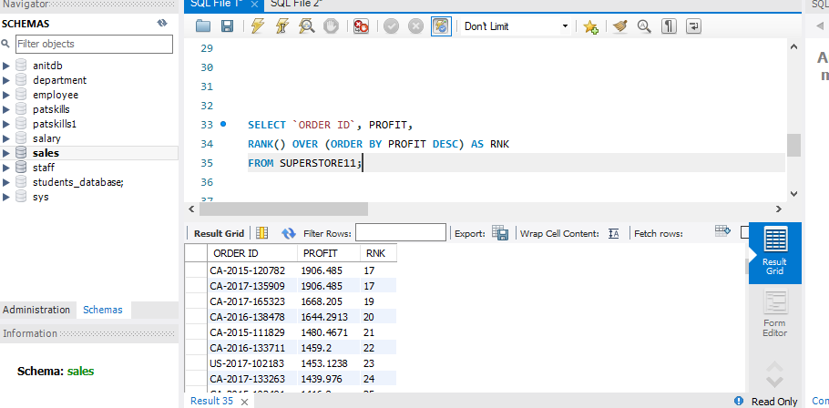
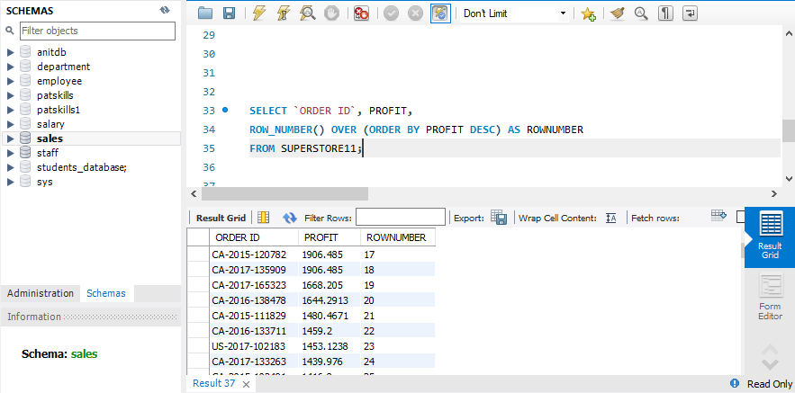
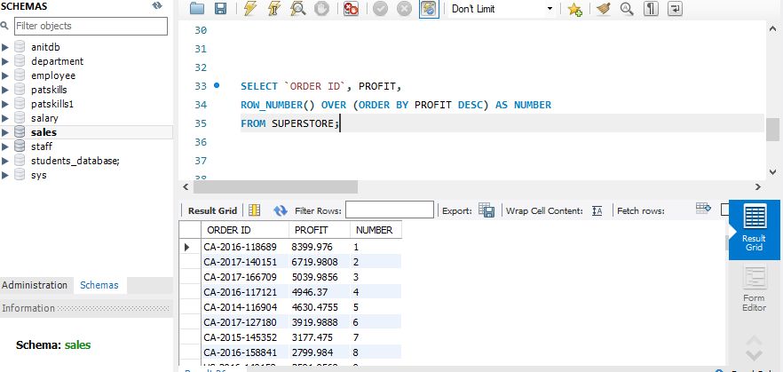
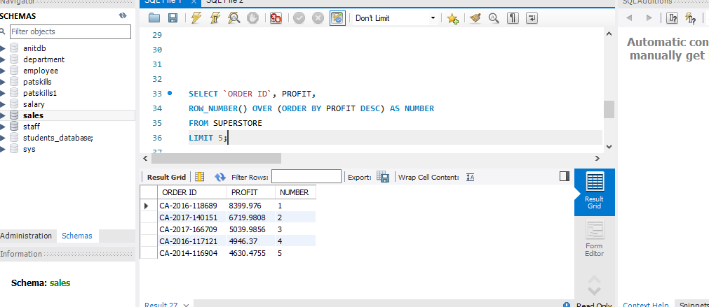

# SQLTASK6

## Replicate the exercise done using RANK, DENSE RANK, and ROW NUMBER with different variables

## USING DENSE RANK
### From the syntax below, you will notice dense rank assigns rows with same rank equal value and the next value is not skipped 
### ORDERID CA-2015-201732 AND ORDERID CA-2017-135909 had the same profit of 1906.485.
### With dense rank, it gives the two ORDERIDs with matching profit 17 and 17, and the following ORDERID CA-2017-1668.205 GETS 18 by dense rank

## USING RANK
### From the syntax below, you will notice rank assigns rows with same rank equal value and the next value is skipped 
### ORDERID CA-2015-201732 AND ORDERID CA-2017-135909 had the same profit of 1906.485.
### With rank, it gives the two ORDERID with matching profit 17 and 17, and the following ORDERID CA-2017-1668.205 with profit 1668.205 GETS 19 by rank

## USING ROW NUMBER
### From the syntax below, you will notice row number assigns a unique value to each row regardless of whether they have matching values or not
### Row number does not handle ties

